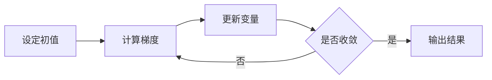

## 数学表达

梯度下降的一次更新可以写成：

$$
x_{k+1}=x_k-\eta\nabla f(x_k)
$$

其中 $\eta$ 是步长。对于 $f(x)=x^2$，梯度为 $2x$。

## 用代码表达

```python
def gradient_step(x, learning_rate=0.1):
    return x - learning_rate * 2 * x

x = 3.0
for step in range(10):
    x = gradient_step(x)
    print(step, x)
```

## 过程可视化



## 再想一步

公式解释关系，代码明确步骤，流程图展现结构。三者放在一起，更适合回顾。
